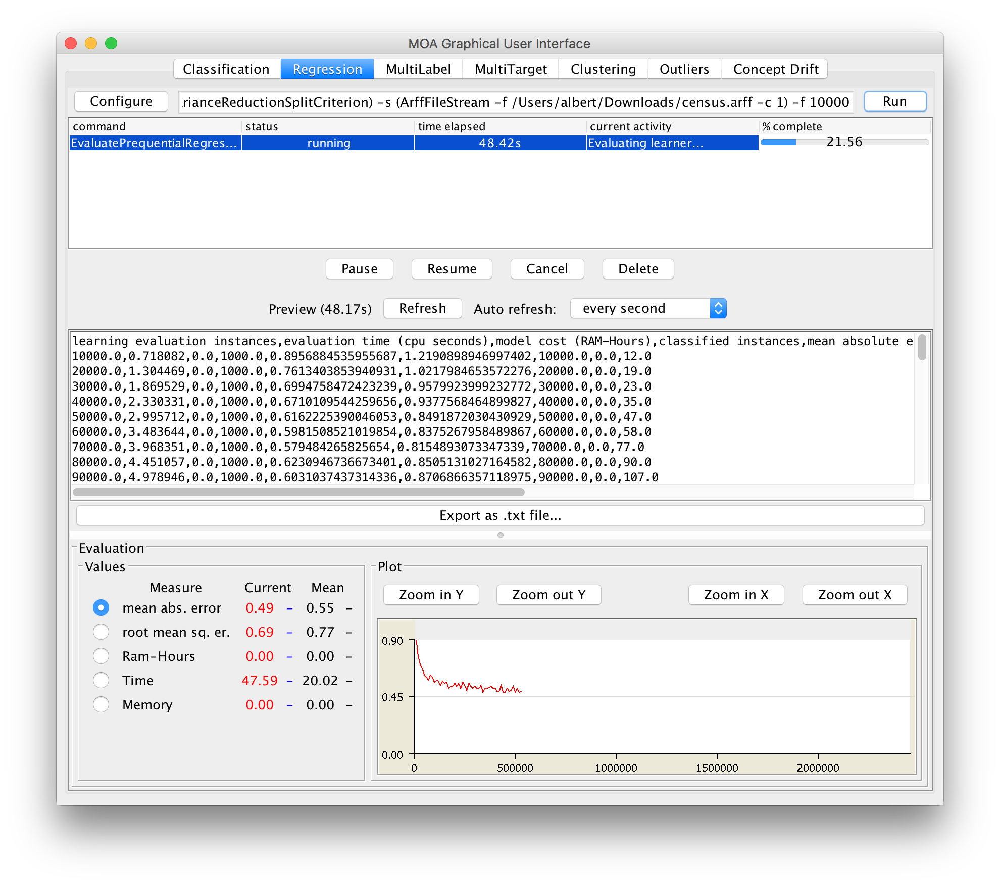

# MOA学习手册
## 开始
1、[下载MOA包](https://sourceforge.net/projects/moa-datastream/)

2、启动

    java -cp moa.jar -javaagent:sizeofag.jar moa.gui.GUI


3、单击“Configure”以设置任务，准备好后单击以启动任务单击“Run”。可以同时运行多个任务。单击列表中的不同任务，并使用下面的按钮控制它们。如果任务的文本输出可用，它将显示在GUI的中间，并可以保存到磁盘。

Note:窗口顶部显示的命令行文本框表示可用于在命令行上运行任务的文本命令。可以选择文本，然后将其复制到剪贴板上。在GUI的底部有一个结果的图形显示。可以比较两个不同任务的结果：当前任务显示为红色，先前选定的任务显示为蓝色。

4、例如，比较两个不同的分类器Naive Bayes和decision tree，使用由默认的RandomTreeGenerator流生成器生成的一百万个实例的预求值：

```
EvaluatePrequential -i 1000000 -f 10000 -l bayes.NaiveBayes
EvaluatePrequential -i 1000000 -f 10000 -l trees.HoeffdingTree
```


prequential评价不同于标准的交叉验证技术。这是一个在线评估，每次新实例到达时，它首先使用它进行测试，然后进行训练。

5、你可以使用ARFF格式文件的流。数据集[下载地址](https://sourceforge.net/projects/moa-datastream/)

```
EvaluatePrequential -s (ArffFileStream -f elec.arff)
```

此外，还可以使用概念漂移生成流，将多个不同的流连接起来。例如，生成SEA 概念数据集，将四个不同的流与一个SEA不同的概念连接起来，每个流都有一个SEA不同的概念：

```
EvaluatePrequential -s (
   ConceptDriftStream -s (generators.SEAGenerator -f 1) -d
     (ConceptDriftStream -s (generators.SEAGenerator -f 2) -d
        (ConceptDriftStream -s (generators.SEAGenerator ) -d
           (generators.SEAGenerator -f 4) -w 50 -p 250000 ) -w 50 -p 250000 ) -w 50 -p 250000)
```

6、你可以继续使用教程（[教程1](https://moa.cms.waikato.ac.nz/tutorial-1-introduction-to-moa/)和[教程2](https://moa.cms.waikato.ac.nz/tutorial-2-introduction-to-the-api-of-moa/)、[教程3](https://moa.cms.waikato.ac.nz/tutorial-3-introduction-to-moa-clustering/)、[教程4](https://moa.cms.waikato.ac.nz/tutorial-4-introduction-to-adams-and-moa/)和[教程5](https://moa.cms.waikato.ac.nz/tutorial-5-simulating-concept-drift-in-moa/)）和手册（[MOA手册](https://sourceforge.net/projects/moa-datastream/files/documentation/Manual.pdf/download)和[MOA数据流挖掘](https://sourceforge.net/projects/moa-datastream/files/documentation/StreamMining.pdf/download)）来学习怎样使用MOA。享受MOA！

## 教程1：MOA简介

### 开始

本教程是MOA的基本介绍。大规模在线分析（MOA）是一个软件环境，用于实现算法和运行实验，以便从不断变化的数据流中在线学习。我们假设MOA安装在您的系统中，如果没有，您可以从这里[下载MOA](https://sourceforge.net/projects/moa-datastream/)。

使用以下命令启动图形用户界面以配置和运行任务：

```
java -cp moa.jar -javaagent:sizeofag-1.0.0.jar moa.gui.GUI
```

或者使用脚本

```
bin/moa.sh
```

或者

```
bin/moa.bat
```

单击“Configure”以设置任务，准备好后单击以启动任务单击“Run”。可以同时运行多个任务。单击列表中的不同任务，并使用下面的按钮控制它们。如果任务的文本输出可用，它将显示在GUI的中间，并可以保存到磁盘。

Note:窗口顶部显示的命令行文本框表示可用于在命令行上运行任务的文本命令。可以选择文本，然后将其复制到剪贴板上。在GUI的底部有一个结果的图形显示。可以比较两个不同任务的结果：当前任务显示为红色，先前选定的任务显示为蓝色。


### 分类图形用户界面

我们开始比较两个分类器的准确性。首先，我们简要说明两种不同的数据流评估。

#### 数据流评估

数据流设置的最重要要求如下：

- **要求1**：一次处理一个示例，并且只检查它一次(最多一次)
- **要求2**：使用有限内存
- **要求3**：在有限的时间内
- **要求4**：随时准备预测

这些要求适用于重复循环：


1、该算法通过流中的下一个可用示例（要求1）。

2、算法处理示例，更新其数据结构。它在不超过其上设置的内存边界（要求2）的情况下执行此操作，并尽可能快地执行此操作（要求3）。

3、算法已经准备好接受下一个示例。根据要求，它能够预测不可见示例的类别（要求4）。

在传统的批量学习中，通过分析和平均由不同随机安排的训练和测试数据产生的多个模型，克服了数据有限的问题。在流设置中，（有效地）无限数据的问题提出了不同的挑战。一种解决方案是在模型导入期间的不同时间拍摄快照，以查看模型改进了多少。当考虑在数据流设置中使用什么过程时，一个独特的关注点是如何建立一个随时间变化的精确图像。主要有两种方法：

- **Holdout** ：当传统的批处理学习达到交叉验证太耗时的程度时，通常会接受在单个holdout集上测量性能。当预先定义了训练集和测试集之间的划分时，这是最有用的，因此不同研究的结果可以直接比较。

- **Interleaved Test-Then-Train or Prequential** ：每个单独的例子都可以在用于训练之前用来测试模型，从中可以逐步更新准确性。当有意按此顺序执行时，模型总是在它没有看到的示例上进行测试。该方案的优点是测试不需要保持集，最大限度地利用了可用数据。它还确保了随着时间的推移，准确度的平滑绘图，因为每个单独的示例对总体平均值的重要性将越来越小。

Holdout评估可以更准确地估计分类器对最新数据的准确性。然而，它需要最近的测试数据，这是很难获得的真实数据集。Gama等人。建议使用一种遗忘机制来使用预测精度估计保持率精度：具有最新观测值的w大小的滑动窗口，或使用衰减因子α衡量观测值的衰落因子。两种机制的输出非常相似（w0大小的每个窗口都可以用一些衰减因子α0来近似）。由于数据流分类是一个相对较新的领域，因此此类评估实践并没有像传统的批量设置中那样得到很好的研究和建立

#### 练习

为了熟悉到目前为止讨论的功能，请做以下两个练习。最后给出了本教程中这些练习和其他练习的解决方案。

**练习1**： 比较Hoeffding树和Naive Bayes分类器的准确性，对于使用交差验证然后训练评估的1000000个实例的随机树生成器流。所有练习的采样频率为10000。

**练习2**：用一棵霍夫丁树使用以下三种不同的评估方法，比较和讨论同练习1一样的数据流下的精度

- 定期进行1000次测试
- 交叉验证，然后训练

- 具有1000个实例的滑动窗口。

#### 漂移流生成器

MOA流是使用生成器、读取ARFF文件、连接多个流或过滤流来构建的。MOA流生成器允许模拟潜在的无限数据序列。两条流在时间上演进为：

1、旋转超平面

2、随机RBF生成器

为了模拟概念漂移，我们只需要设置流的漂移参数。

有关流生成器的更详细解释，请参阅教程5。

#### 练习

**练习3** 比较Hoeffding树和朴素Bayes分类器的准确性，对于速度变化为0001的1000000个实例的RandomRBFGeneratorDrift，使用交差验证，然后进行训练评估。

**练习4** 在相同流的情况下，比较使用三个不同的分类器同前一个练习准确性：

1、霍夫丁树多数分类在叶子

2、霍夫丁自适应树

3、OzaBagAdwin与10 HoeffdingTree

### 使用命令行

使用命令行的一种简单方法是在图形用户界面的配置行中复制和粘贴文本。例如，假设我们要处理任务

```
EvaluatePrequential -l trees.HoeffdingTree -i 1000000 -w 10000
```

使用命令行。我们只是写

```
java -cp moa.jar -javaagent:sizeofag-1.0.0.jar moa.DoTask \
"EvaluatePrequential -l trees.HoeffdingTree -i 1000000 \
-e (WindowClassificationPerformanceEvaluator -w 10000)"
```

Note：缺少一些参数，因为它们使用默认值。

#### 学习与评价模型

DoTask类是在命令行上运行任务的主要类。它将接受任务的名称，后跟任何适当的参数。使用的第一个任务是LearnModel任务。-l参数指定学习者，在本例中是hoefffdingtree类。-s参数指定要学习的流，在本例中为generators.waveormgenerator，它是一个数据流生成器，它产生一个识别三种波形的三类学习问题。m选项指定训练学习者的最大示例数，在本例中为一百万个示例。-O选项指定要将结果模型输出到的文件：

```
java -cp moa.jar -javaagent:sizeofag-1.0.0.jar moa.DoTask \
LearnModel -l trees.HoeffdingTree \
-s generators.WaveformGenerator -m 1000000 -O model1.moa
```

这将创建一个名为model1.moa的文件，其中包含在训练期间诱导的决策树桩模型。下一个示例将评估该模型，以查看它在使用不同随机种子生成的一组示例上的准确性。EvaluateModel任务给出了加载上一步生成的模型、生成随机种子数为2的新波形流以及在一百万个示例上进行测试所需的参数：

```
java -cp moa.jar -javaagent:sizeofag-1.0.0.jar moa.DoTask \
"EvaluateModel -m file:model1.moa \
-s (generators.WaveformGenerator -i 2) -i 1000000"
```

这是使用括号嵌套参数的第一个示例。在任务的描述周围添加了引号，否则操作系统可能会混淆括号的含义。评估后，输出以下统计信息：

```
classified instances = 1,000,000
classifications correct (percent) = 84.474
Kappa Statistic (percent) = 76.711
```

注意，上述两个步骤可以通过将它们滚动到一个中来实现，从而避免创建外部文件，如下所示：

```
java -cp moa.jar -javaagent:sizeofag-1.0.0.jar moa.DoTask \
"EvaluateModel -m (LearnModel -l trees.HoeffdingTree \
-s generators.WaveformGenerator -m 1000000) \
-s (generators.WaveformGenerator -i 2) -i 1000000"
```

任务评估EvaluatePeriodicHeldOutTest将训练一个模型，同时以周期间隔使用保持测试集对性能进行快照。以下命令创建一个逗号分隔的值文件，对HoeffdingTree分类器进行WaveformGenerator数据培训，使用前10万个示例进行测试，对总共1亿个示例进行培训，并每100万个示例进行测试：

```
java -cp moa.jar -javaagent:sizeofag-1.0.0.jar moa.DoTask \
"EvaluatePeriodicHeldOutTest -l trees.HoeffdingTree \
-s generators.WaveformGenerator \
-n 100000 -i 10000000 -f 1000000" > dsresult.csv
```

#### 练习

**练习5** ：使用命令行重复练习1和2的实验。

**练习6** ：使用以下方法，对基于半径的随机函数流进行1000000个实例的预测性评估（1000个实例的滑动窗口），比较精度和所需的RAM时数（更改速度为0001）：

1. OzaBag with 10 HoeffdingTree
2. OzaBagAdwin with 10 HoeffdingTree
3. LeveragingBag with 10 HoeffdingTree

## 回归

对于回归，让我们回到GUI。选择“回归”选项卡。单击“配置”并浏览选项。你会发现有很多选择比分类少。这不一定是个问题，因为像基于树的FIMTDD方法这样的算法在实践中非常有效。运行默认配置以进行回归选项卡的首次浏览。当我们在这里滥用由RandomTreeGenerator生成的分类数据集时，结果没有那么令人信服也就不足为奇了。为了获得更好的体验，请返回到配置，选择arff file stream作为流源，并提供一些大型数值arff文件。您可以使用“census.arff”文件并将第一个属性指定为目标：-c 1。现在再次运行FIMTDD。如果你想要一个更快的回归器，也可以试试感知器。为了获得更好的结果，但执行速度较慢，请尝试使用各种（随机）规则学习者。

[Census Dataset](http://www.cs.waikato.ac.nz/~bernhard/halifax17/census.arff.gz)



#### 练习答案

1、朴素贝叶斯：73:63%；霍夫丁树：94:45%

2、定期进行1000次测试：96:5%

​	  交叉测试：94:45%

​      具有1000个实例的滑动窗口的预测：96:7%。

3、朴素的贝叶斯：53:14%；霍夫丁树：57:60%

4、霍夫丁树多数分类在叶子：51:71%

​      霍夫丁自适应树：66:26%

​	  OzaBagAdwin与10 HoeffdingTree：68:11%

5、EvaluateInterleavedTestThenTrain -i 1000000
	  EvaluateInterleavedTestThenTrain -l trees.HoeffdingTree -i 1000000
	  EvaluatePeriodicHeldOutTest -n 1000 -i 1000000
	  EvaluateInterleavedTestThenTrain -l trees.HoeffdingTree -i 1000000
 	 EvaluatePrequential -l trees.HoeffdingTree -i 1000000

6、OzaBag with 10 HoeffdingTree:

- 62.1% Accuracy, 4×10-4 RAM-Hours

  OzaBagAdwin with 10 HoeffdingTree:

- 71:5% Accuracy, 2:93×10-6 RAM-Hours

  LeveragingBag with 10 HoeffdingTree:

- 84.40% Accuracy, 1:25x 10-4 RAM-Hours

## 教程2:MOA API介绍

#### 使用API

在Java代码中很容易使用MOA的方法。例如，这是一个prequential评估的Java代码:

#### 练习

**练习1**：用Java编写一个程序，该程序使用一个流学习模型，并使用另一个流测试模型。

#### 编写一个新的分类器

为了演示学习算法在系统中的实现和操作，研究了一个简单决策树桩分类器的Java代码。分类器监控对每个属性的分割结果，并根据信息增益选择似乎最适合分割类的属性。这个决定被重复了很多次，因此随着时间的推移，随着更多的例子被看到，这个树桩可能会发生变化。在实践中，经过充分的训练，这种情况不太可能改变。

为了描述实现，我们依次讨论了相关的代码片段，最后列出了整个代码。片段中的行号与最终的列表匹配。

编写分类器的一个简单方法是扩展moa.classifier。抽象分类器和实现多类分类器(第16行)，它将处理某些细节以简化任务。

```
public IntOption gracePeriodOption = new IntOption("gracePeriod", 'g',
        "The number of instances to observe between model changes.",
        1000, 0, Integer.MAX_VALUE);
 
public FlagOption binarySplitsOption = new FlagOption("binarySplits", 'b',
        "Only allow binary splits.");
 
public ClassOption splitCriterionOption = new ClassOption("splitCriterion",
        'c', "Split criterion to use.", SplitCriterion.class,
        "InfoGainSplitCriterion");
```

要设置分类器的公共接口，必须指定用户可用的选项。为了让系统自动处理选项处理，选项需要是类的公共成员，扩展moa.options。选择类型。

决策树桩分类器示例有三个选项，每个选项都有不同的类型。用于构造选项的前三个参数的含义在不同的选项类型之间是一致的。第一个参数是用于标识选项的短名称。第二个字符用于命令行。它应该是惟一的——对于不同的选项，命令行字符不能重复，否则会引发异常。第三个标准参数是描述选项用途的字符串。选项构造函数的其他参数允许指定默认值和有效范围等内容。

为决策树桩分类器指定的第一个选项是“宽限期”。该选项用整数表示，因此该选项的类型为IntOption。该参数将控制从一系列示例学习时重新考虑最佳残桩的频率。这就提高了分类器评估的效率，因为每个例子都是昂贵的，而且一个例子不太可能改变当前最佳树桩的决策。默认值1000表示只在上次评估后观察到1000个示例后才会重新评估残差的选择。最后两个参数指定了允许该选项的值的范围——设置负的宽限期没有意义，因此范围被限制为整数0或更大。

第二个选项是一个标志，或者一个二进制开关，用一个标志选项表示。默认情况下，所有标志都是关闭的，只有当用户发出请求时才会打开。该标志控制是否只允许决策分支一分为二。默认情况下，树桩允许有两个以上的分支。

第三个选项确定用来决定哪个树桩是最好的分割标准。这是一个类选项，需要使用SplitCriterion类型的特定Java类。如果所需的类恰好是OptionHandler，那么这些选项将用于配置传入的对象。

```
protected AttributeSplitSuggestion bestSplit;
 
protected DoubleVector observedClassDistribution;
 
protected AutoExpandVector<AttributeClassObserver> attributeObservers;
 
protected double weightSeenAtLastSplit;
 
public boolean isRandomizable() {
    return false;
}
```

使用四个全局变量来维护分类器的状态。

bestSplit字段维护分类器选择的当前残桩。它的类型是AttributeSplitSuggestion，一个用于将实例拆分为不同子集的类。

observedClassDistribution字段记住分类器观察到的类标签的总体分布。它的类型是DoubleVector，这是一个方便的类，用于维护浮点值向量，而不需要管理其大小。

attributeobserver字段存储一组AttributeClassObservers，每个属性一个。这是决定树桩的最佳属性所需要的信息。

weightSeenAtLastSplit字段记录最后一次执行评估的时间，以便可以根据宽限期参数确定下一次评估的截止时间。

需要实现isRandomizable()函数来指定分类器是否具有随机性元素。如果是，它将自动设置为接受随机种子。这个分类器is not，因此返回false。

```
43@Override
44public void resetLearningImpl() {
45    this.bestSplit = null;
46    this.observedClassDistribution = new DoubleVector();
47    this.attributeObservers = new AutoExpandVector<AttributeClassObserver>();
48    this.weightSeenAtLastSplit = 0.0;
49}
```

这个函数在任何学习开始之前调用，因此当没有提供任何信息，也没有看到任何训练示例时，它应该设置默认状态。在本例中，四个全局字段被设置为合理的默认值。

```
51@Override
52public void trainOnInstanceImpl(Instance inst) {
53    this.observedClassDistribution.addToValue((int) inst.classValue(), inst
54            .weight());
55    for (int i = 0; i < inst.numAttributes() - 1; i++) {
56        int instAttIndex = modelAttIndexToInstanceAttIndex(i, inst);
57        AttributeClassObserver obs = this.attributeObservers.get(i);
58        if (obs == null) {
59            obs = inst.attribute(instAttIndex).isNominal() ?
60                newNominalClassObserver() : newNumericClassObserver();
61            this.attributeObservers.set(i, obs);
62        }
63        obs.observeAttributeClass(inst.value(instAttIndex), (int) inst
64                .classValue(), inst.weight());
65    }
66    if (this.trainingWeightSeenByModel - this.weightSeenAtLastSplit >=
67            this.gracePeriodOption.getValue()) {
68        this.bestSplit = findBestSplit((SplitCriterion)
69            getPreparedClassOption(this.splitCriterionOption));
70        this.weightSeenAtLastSplit = this.trainingWeightSeenByModel;
71    }
72}
```

这是学习算法的主要功能，调用了流中的每个训练实例。第一步，第47-48行，更新类的总体记录分布。对于数据中的每个属性，从第49行到第59行进行循环。如果之前没有看到某个特定属性的观察结果，那么第53-55行创建一个新的观察对象。第57-58行使用新示例中的值更新观察结果。第60-61行检查宽限期是否已经过期。如果是这样，则重新评估最佳分割。

```
85protected AttributeClassObserver newNominalClassObserver() {
86   return new NominalAttributeClassObserver();
87}
88 
89protected AttributeClassObserver newNumericClassObserver() {
90    return new GaussianNumericAttributeClassObserver();
91}
92 
93protected AttributeSplitSuggestion findBestSplit(SplitCriterion criterion) {
94    AttributeSplitSuggestion bestFound = null;
95    double bestMerit = Double.NEGATIVE_INFINITY;
96    double[] preSplitDist = this.observedClassDistribution.getArrayCopy();
97    for (int i = 0; i < this.attributeObservers.size(); i++) {
98        AttributeClassObserver obs = this.attributeObservers.get(i);
99        if (obs != null) {
100            AttributeSplitSuggestion suggestion =
101                obs.getBestEvaluatedSplitSuggestion(
102                    criterion,
103                    preSplitDist,
104                    i,
105                    this.binarySplitsOption.isSet());
106            if (suggestion.merit > bestMerit) {
107                bestMerit = suggestion.merit;
108               bestFound = suggestion;
109            }
110        }
111    }
112    return bestFound;
113}
```

这些函数辅助训练算法。newNominalClassObserver和newNumericClassObserver分别负责为名义和数字属性创建新的观察者对象。findBestSplit()函数将遍历所有可能的树桩，并返回“优点”得分最高的那个。

```
74public double[] getVotesForInstance(Instance inst) {
75    if (this.bestSplit != null) {
76        int branch = this.bestSplit.splitTest.branchForInstance(inst);
77        if (branch >= 0) {
78            return this.bestSplit
79                    .resultingClassDistributionFromSplit(branch);
80        }
81    }
82    return this.observedClassDistribution.getArrayCopy();
83}
```

这是分类器除了训练之外的另一个重要功能——使用已被诱导的模型来预测例子的类别。对于决策树桩，这涉及调用branchForInstance()函数和resultingClassDistributionFromSplit()函数，这是由AttributeSplitSuggestion类实现的。

将所有元素放在一起，教程类的完整列表如下所示。

#### 练习

**练习2**:用Java编写一个实现K近邻算法的分类器。

## 教程3:MOA集群介绍

本教程是关于如何使用MOA执行集群的基本介绍。

### 任务1:开始

MOA提供了几种集群流式算法的实现。出于实验目的，MOA还提供了一种进化的人工数据流生成器，其中表面真相是已知的。也可以从ARFF格式的文件[http://www.cs.waikato. ac.nz/ml/weka/arff.html](http://www.cs.waikato.ac.nz/ml/weka/arff.html)中读取数据。在本教程中，我们将使用人工流生成器。

#### 用于集群任务配置的GUI

启动MOA之后，如果选择Clustering选项卡(图中元素1)，应该会看到以下GUI。


GUI中编号的元素如下所示:

- **元素1**:有几个制表符、分类、回归、聚类、离群值等。这里选择了clustering选项卡。

- **元素2**:集群GUI分为两部分，“setup”和“visualisation”。这两个部分可以通过这个元素中的两个制表符来选择。在图1中，选择了“Setup”。

- **元素3**:在这里，您可以选择和配置一个数据流和两个集群算法，这些算法可以在MOA中实时执行和比较。

- **元素4**:在这里，您可以选择用于评估聚类算法的各种评估指标。这里选择的指标也可以在集群GUI的“可视化”部分中使用。

- **元素5**:使用这些按钮，您可以启动或停止集群任务。

- **元素6**:显示了命令行输出。

#### 用于集群任务可视化的GUI

如果您选择集群GUI的元素2中的可视化部分(并单击“Start”按钮)，那么您应该会看到如下内容:


GUI的这一部分允许实时可视化地观察正在构建的集群，实时地观察性能指标，并中断和恢复集群任务。这里你可以使用以下GUI元素:

- **元素7**: GUI的这一部分提供了启动、停止(取消)或恢复集群分析的按钮。聚类分析通常在到达用户定义的传入数据项数量之后停止。同样，这可以在右侧的这个元素中指定(在屏幕截图中，该元素被设置为观察到的50,000个数据项)。在这里，您还可以选择是否要显示微集群、实际集群、当前时间范围内的数据点或/和ground truth(实际集群)。

- **元素8**:显示了两个集群算法选择的微集群、实际集群、当前时间范围内的数据点或/和ground truth(实际集群)。左边是“算法1”，右边是“算法2”。

- **元素9**:左侧列出了先前在元素4中选择的性能指标及其当前值;右边是实时绘制的。你只能同时绘制一个度规。蓝色的图是在元素8的右侧显示的算法的度量(对应于算法2);红色的图是在元素8的左手边显示的算法的度量(对应于算法1)。

#### 在MOA中实现的聚类评价方法

+ 外部方法:当有基础事实可用时应用。其目的是在地面真实度可用时为聚类分配一个分数。

  **Purity**的定义是

.png)


越高越好，c是簇的数目。     

​		**SSQ**：数据项到其簇中心的平方距离之和。越小越好。类似于凝聚力。越低越好。

​		**Homogeneity(同质性)**:每个集群只包含单个类的成员。下限为0.0，上限为1.0（越高越好）。

​		**Completeness(完整性)**:给定类的所有成员都分配给同一个集群。下限为0.0，上限为1.0（越高越好）。

* 内在的方法:当事实是不可得的时候应用。大多数情况下，我们想要评估星系团是如何紧密和分离的。
    \- 次级
  + **Silhouette Coefficient** 是分离和聚合措施的结合


可以计算出单个点的剪影系数s，也可以计算出簇的剪影系数s。对于单个点，a = i到同一簇内点的平均距离;b = i到另一簇点的平均距离。

.png)

这通常是一个介于0和1之间的值，假设a这个越接近1越好。


在这个例子中:

.png)

在MOA中，计算了一组簇的平均轮廓。

### 任务2:数据流集群配置
首先，您需要配置不断发展的数据流。单击数据流的edit按钮上的元素3。这将打开以下对话框:


在对话框的顶部，您可以选择从一个ARFF格式的文件加载您自己的流数据，或者您可以选择randomrbfgeneratore流。这是一个不断发展和改变真正集群位置的流。按原样接受设置。稍后我们将重新访问一些设置。接下来点击算法1的edit按钮，设置第一个数据流聚类算法。应该会打开一个新对话框。在这个对话框的顶部，您可以选择集群算法。请选择Clustream。

对话框现在应该会显示Clustream的设置，如下图所示:


使用horizon，您可以指定宏集群计算的时间范围。在这里，每接收1000个数据元素就会生成一个宏集群。设置maxNumOfKernels指定微集群的数量，通过设置kernelRadiFactor，您可以对微集群的半径(边界)施加影响(即增加或减少边界)。保持默认设置。接下来以同样的方式配置算法2。在元素4中选择一些评估指标，特别是选择SSQ。单击元素2中的“Visualisation”选项卡，然后单击start(元素7)，观察正在实时生成和更新的集群。尝试一下元素7中的选择，您可以使用元素7中的控件在任何时候停止并恢复算法执行。

#### 练习

**练习1**

试着找出集群算法的不同方面是如何可视化的:

简要记录微簇是如何可视化的:

简要记录实际集群是如何可视化的:

简要地记下地面真相是如何被视觉化的:

现在尝试一下评估指标，请注意，这里有比我们在本教程中了解到的更多的指标。

### 任务3:优化Clustream算法

Task 1中使用的RandomRBFGeneratorEvents流是不断发展的，它可以通过流对话框中的两个参数进行管理。参数speed每X点将实际集群中心移动0.01的预定义距离，而参数speedRange即速度/速度点偏移量。

**练习2**

将速度加倍到1000，并将speedRange设置为10。同时将噪声级别提高到0.333，这意味着大约每三分之一的数据项是随机生成的。

现在，尝试找到保持低SSQ指标的设置。记下你的观察结果，即当你增加微星团的数量或改变半径时，你观察到了什么变化？

### 任务4:比较两种数据流算法

**练习3**：现在对数据流使用与在Task 2中相同的设置，并将CluStream设置为算法1，使用与在Task 2中获得最佳结果相同的设置。但这次你用的是“算法2”的Clustree。这是一个分层聚类算法，允许调整两个参数，水平和层次的高度。尝试优化Clustree的设置。再次记下你的观察结果:

### 任务5:实验

**练习4**：尝试使用其他集群算法，看看是否可以找到一种算法，其设置在Task 2中列出的数据流设置上的性能优于Clustream和Clustree。

您还可以检查数据更改对算法的影响，即增加噪音级别，并观察哪些算法能够最好地处理这些更改。

## 教程4:对ADAMS和MOA的介绍

### 开始

WEKA和MOA是执行数据挖掘分析任务的强大工具。通常，在实际的应用程序和专业设置中，数据挖掘过程是复杂的，包括几个步骤。这些步骤可以看作是一个工作流。专业的数据挖掘人员将使用工作流来构建解决方案，而不是用JAVA来实现程序，因此对于非程序员用户来说，维护起来要容易得多。

高级数据挖掘和机器学习系统(ADAMS)是一种新颖、灵活的工作流引擎，旨在快速构建和维护真实世界的复杂知识工作流。


ADAMS的核心是工作流引擎，它遵循“少即是多”的哲学。与让用户将操作符(用ADAMS的话说就是参与者)放在画布上然后手工连接输入和输出不同，ADAMS使用了一种类似于树的结构。这个结构和控制角色定义了数据在工作流中是如何流动的，不需要显式的连接。类树结构源于内部对象表示和actor处理程序中的子参与者的嵌套。


我们假设您的系统中安装了ADAMS。启动流编辑器并加载adams-moa-classifier-evaluation流。运行流程。注意:


- Kappa统计量是一个分类器和一个已运行的分类器的一致性度量。如果Kappa统计量为零，分类器将作为一个随机的分类器执行，如果它等于1，那么它就不是随机的。

- 一个决策残桩是一个只有一个分裂节点的决策树。

**练习1**:解释这个工作流的作用。讨论为什么准确率在增加而kappa统计值在下降。如果你用Hoeffding树代替决策树桩会发生什么?


### 使用ADAMS分类

我们开始比较两个分类器的准确性。首先，我们简要地解释了两种不同的数据流计算。

#### 数据流的评估

数据流设置的最重要的要求如下:

- **要求1**：一次处理一个例子，并且只检查它一次(最多)

- **要求2**：使用有限的内存

- **要求3**：在有限的时间内完成工作

- **要求4**：随时准备进行预测


该图展示了数据流分类算法的典型应用，以及需求如何适应一个重复循环:

- 算法从流中传递下一个可用的例子(要求1)。

- 算法对实例进行处理，更新数据结构。它在不超过设置的内存限制的情况下执行(要求2)，并尽可能快地执行(要求3)。

- 该算法可以接受下一个示例。根据要求，它能够预测不可见示例的类别(要求4)。

在传统的批处理学习中，通过对训练和测试数据的不同随机排列产生的多个模型进行分析和平均，克服了数据有限的问题。在流中设置(有效地)无限数据的问题带来了不同的挑战。一种解决方案涉及在模型归纳期间的不同时间拍摄快照，以查看模型改进了多少。

当考虑在数据流设置中使用什么过程时，一个独特的关注点是如何构建随时间变化的准确性。出现了两种主要方法:

- **Holdout**: 当传统的批量学习达到一个规模,交叉验证太耗费时间,通常是接受而不是衡量一个抵抗组的性能。这是最有用的,当训练集和测试集之间的分工已经预先定义的,这从不同的研究结果可以直接比较。

- **Interleaved Test-Then-Train or Prequential**: 每个单独的例子都可以在用于训练之前用来测试模型，并且从这一点可以增量地更新准确性。当有意按这个顺序执行时，模型总是在未见过的例子上进行测试。该方案的优点是测试不需要保持集，最大限度地利用了可用的数据。随着时间的推移，它还确保了准确性的平滑图，因为每个单独的例子对总体平均值的重要性将越来越小。

Holdout评估可以更准确地估计分类器对更近期数据的准确性。但是，它需要最近的测试数据，这对于真实的数据集来说是很难获得的。Gama等人提出使用一种遗忘机制来估计使用前项精度的holdout精度:一个大小为w的滑动窗口，其中包含最新的观测结果，或者使用衰减因子alpha来衡量观测结果的衰落因子。这两种机制的输出非常相似(大小为w_0的每个窗口都可以用一些衰减因子\alpha_0进行近似)。

由于数据流分类是一个相对较新的领域，这种评估实践并没有像在传统批处理设置中那样得到很好的研究和建立。

#### 练习

为了熟悉到目前为止讨论的函数，请执行以下两个练习，加载和修改adams-moa-compare-classifiers流。

**练习2**：比较Hoeffding树和Naive Bayes分类器的准确性，使用交叉测试-然后-训练的评估方法生成一个包含10,000个实例的随机树生成器流。

**练习3**：使用Hoeffding树的两种不同的评估来比较和讨论前面练习的同一流的准确性:

- Interleaved Test Then Train
- Prequential with a sliding window of 100 instances.

#### 漂移流生成器

MOA流是使用生成器、读取ARFF文件、加入多个流或过滤流来构建的。MOA streams生成器允许模拟可能无限的数据序列。

两种随时间变化的流是:

- 旋转的超平面

- 随机RBF生成器

为了对概念漂移进行建模，我们只需要设置流的漂移参数。

#### 练习：

**练习4**：比较Hoeffding树和Naive Bayes分类器的准确性，使用交叉测试-然后-训练评估方法对50,000个实例且速度变化为0,001的RandomRBFGenerator流进行测试。

**练习5**：使用三种不同的分类器来比较前面练习的同一流的准确性:

- Hoeffding Tree with Majority Class at the leaves
- Hoeffding Adaptive Tree
- OzaBagAdwin with 10 HoeffdingTree

## 教程5:在MOA中模拟概念漂移

### 1、开始之前

本教程的重点是向您展示如何使用MOA框架轻松地模拟合成数据流上的突变、渐变、增量和混合漂移。

声明：

- 本教程最初是为MOA发行版2016.04开发的，但它也适用于当前的MOA 2017.06版本([在这里获取](https://moa.cms.waikato.ac.nz/downloads/))。事实上，它将与以前和未来的版本一起工作，因为漂移模拟框架已经存在了一段时间，不太可能改变。

- 我们假设您已经熟悉了什么是概念漂移。如果你不是，那么请参考这篇论文[1]。此外，在“数据流挖掘:实用方法”一书的第2章(第2.7节和2.7.1节)中，您还可以找到关于如何在MOA中模拟概念漂移的有用资料，这些资料可以在[文档页面](https://moa.cms.waikato.ac.nz/documentation/)免费获得。

- 所有的例子都是使用MOA GUI和命令行提供的。要运行示例，您必须复制并粘贴MOA GUI中的命令行(参见“运行示例”一节中的说明)。

- 本教程不介绍RecurrentConceptDriftStream类，该类允许轻松地模拟周期性概念漂移。

- 我们不讨论所使用的评估方法的细节。我们只是使用默认的求值前传配置。对它如何影响评价作了一些评论，但对这一问题还没有深入的讨论。对于那些对数据流的最新评估程序感兴趣的人，我们建议使用本文[2]。

- 要生成本教程中可用的绘图，请使用这里提供的[脚本](https://github.com/hmgomes/data-stream-visualization)

合成数据流生成器通常用于评估用于数据流设置的机器学习算法。使用合成数据流的一个动机是，人们可以很容易地在上面模拟不同类型的漂移，并使用它来评估特定算法在给定不同类型漂移情况下的执行情况。在本教程中，我们将使用3个不同的生成器:SEA[3]、AGRAWAL[3]和超平面[4]。

本教程分为6个部分。第一部分简要介绍如何在MOA GUI和命令行中运行示例。在第二节中，我们将演示如何模拟渐变和突变漂移。在第三节中，我们将演示如何模拟渐变和突变漂移。第四部分展示了如何模拟增量漂移。第5节说明如何将前几节中生成的合成数据流保存到ARFF (weka格式)文件中，这样即使在MOA之外也可以使用这些文件。最后一部分是练习技巧的练习。

### 2、运行例子

要运行示例，您可以使用MOA GUI或命令行。要在GUI上运行它们，最简单的方法是复制和粘贴每个示例中的命令行。整个过程如下:

右击Configure按钮旁边的文本输入，如图1所示。


Figure 1: Location of the text input to paste commands

Choose “Enter configuration” as in Figure 2.


Figure 2: Enter configuration selection

Paste the command line in the text dialog as in Figure 3.


Figure 3: Text input to paste the command

运行命令在命令行中您将需要改变目录(cd或chdir取决于您的操作系统)的位置MOA.jar和执行一个命令如下所示(替换文本在双引号中给定的命令示例):

```
java -cp moa.jar moa.DoTask “EvaluatePrequential -l bayes.NaiveBayes -s (ConceptDriftStream -s (generators.SEAGenerator -f 3) -d (generators.SEAGenerator -f 2) -p 50000 -w 20000) -i 100000 -f 1000”
```

#### 2.1可选:在GUI上配置

您可以选择使用GUI配置整个设置。如果您想配置一个合成数据流来模拟漂移，这很可能就是您需要做的事情。本小节的其余部分提供了一步一步的说明。

1)选择“Configure”按钮，如图4所示。


Figure 4: Choose “Configure” button

2)在流选项中选择“编辑”。确保在配置的顶部有EvaluatePre- quential或其他评估方法。注意，在Task(在本例中是EvaluatePrequential)窗口中，要生成的实例总数是使用instanceLimit参数选择的。


Figure 5: Configuring the stream

3)将数据流(图6顶部的下拉菜单)更改为moa.streams。如图7所示。


Figure 6: Choose the drop down at the top


Figure 7: Choose moa.streams.ConceptDriftStream

4)在图8中显示了ConceptDriftStream的选项。基本上，配置参数是很重要的:

- *stream*:第一个概念将使用此流配置生成。

- *driftstream*:下一个概念将使用这个流配置生成。

- *position*:以实例数表示的偏移中心的位置。

- *width*:漂移窗口的长度，即。，发生偏移的实例数。

请注意，参数alpha对于配置底层sigmoid函数也很重要，该函数对从一个概念到另一个概念的转换进行建模，但是调整alpha超出了本教程的范围。


Figure 8: The ConceptDriftStream parameters

5)最后，图9显示了一个“单漂移”流的可能配置。在本教程的其余部分中，将介绍并评论其他配置，但有一点很重要，即可以在driftstream中配置另一个ConceptDriftStream，从而允许在同一流上模拟多个driftstream。


Figure 9: One possible configuration for ConceptDriftStream using SEAGenerator

### 3.模拟突然和逐渐的漂移

基本上，在MOA中引入人工概念漂移的实验框架模拟了一个变化窗口，其中给定实例属于新概念的当前概念的概率由一个sigmoid函数控制。让我们名字当前概念B和新概念,基本上在窗口的一个实例的概率从较高,画在窗口的结束的概率从它被从B增加时,在窗口结束后将所有实例从B(“新概念”B现在稳定)。

#### 3.1例1:利用SEA逐步漂移

在本例中，我们使用SEA生成器来创建10万个实例，这样就会有一个以实例50,000为中心的偏移，窗口为20,000个实例。

示例1的命令行如下所示:

```
EvaluatePrequential -l bayes.NaiveBayes -s (ConceptDriftStream -s (gen- erators.SEAGenerator -f 3) -d (generators.SEAGenerator -f 2) -p 50000 -w 20000) -i 100000 -f 1000
```

这些命令的细目如下:

- **EvaluatePrequential**:使用的评价方法

- **-l bayes.NaiveBayes**:学习者使用

- **-i 100000 -f 1000**:确定合成生成器要生成的实例总数(-i参数:100,000)和报告评估指标值之间的实例数量(-f参数:1,000)。

- **-s (ConceptDriftStream -s (generators.SEAGenerator -f 3) -d (genera- tors.SEAGenerator -f 2) -p 50000 -w 20000)**:这是本教程中命令中最重要的部分，因为它配置了如何模拟漂移。参数-s表示下面的命令是要在计算中使用的数据流的配置。我们使用模拟漂移的主要类ConceptDriftStream，注意它有两个数据流参数-s和-d，这样第一个参数对应于当前概念，第二个参数对应于“新概念”或“漂移概念”。参数-p表示漂移在数据流中的位置(即第50,000个实例)，-w表示漂移窗口中的实例数量(即20k个实例)。

最后，一个重要的问题是:“SEAGenerator -f 3和SEAGenerator -f 2之间有什么区别?”为了模拟概念漂移，我们需要改变概念，要做到这一点，我们需要一个具有可想象的数据分布的生成器。在这种情况下，SEA有四个功能，可以通过变量来彻底改变底层概念。在我们的例子中，我们从带函数3的SEA转换到带函数2的SEA。

图10显示了示例1的结果。注意精度是如何在漂移窗口内开始下降的，以及如何在使用的分类器(朴素贝叶斯)没有实现任何漂移适应技术的情况下无法恢复。

有时这可能不会发生，因为所选的分类器包含了内置的漂移适应技术。


Figure 10: Example 1 results. Solid and dashed vertical red lines indicates drifts and drift window start/end, respectively.

#### 3.2例2:利用SEA的突变漂移

要模拟突然漂移，只需将漂移长度设置为1，即-w设置为1。我们使用与示例1相同的命令，惟一的区别是漂移窗口的大小。

示例2的命令行如下所示:

```
EvaluatePrequential -l bayes.NaiveBayes -s (ConceptDriftStream -s (gen- erators.SEAGenerator -f 3) -d (generators.SEAGenerator -f 2) -p 50000 -w 1) -i 100000 -f 1000
```

图11显示了示例2的结果。请注意，在偏移之后，准确度急剧下降。


Figure 11: Example 2 results. The solid red line indicate the abrupt drift location.

### 4. 模拟多重和混合漂移

MOA漂移模拟框架可以很容易地扩展，以模拟同一数据流上的各种漂移和流上不同位置的漂移。在下面的例子中，我们展示了如何使用它来模拟具有多个突变(也可以是渐变的)和混合突变和渐变的流。

4.1例3:多次突变漂移

在本例中，我们将使用AGRAWAL生成器。模拟多个漂流的“catch”是递归地使用ConceptDriftStream类。在这个例子中，我们还展示了一个经典的集成分类器方法的结果，该方法可以处理概念漂移。，利用Bagging[5]算法。

使用Naive Bayes执行例3的命令如下:

```
EvaluatePrequential -l bayes.NaiveBayes -s (ConceptDriftStream -s gen- erators.AgrawalGenerator -d (ConceptDriftStream -s (generators.AgrawalGenerator -f 2) -d (ConceptDriftStream -s generators.AgrawalGenerator -d (generators.AgrawalGenerator -f 4) -p 25000 -w 1) -p 25000 -w 1) -p 25000 -w 1) -i 100000 -f 1000
```

图12显示了Naive Bayes和利用3个突然概念漂移的AGRAWAL数据流的Bagging的结果。请注意如何更好地利用套袋从漂移中恢复，而不是简单的贝叶斯。


Figure 12: Example 3 results. The solid red line indicate the drifts locations.

#### 4.2例4:混合漂移

这个例子非常类似于例3，唯一的例外是，第一次和最后一次漂移是渐进的，而不是突然的。

使用Naive Bayes的命令例4如下所示:

```
EvaluatePrequential -l bayes.NaiveBayes -s (ConceptDriftStream -s generators.AgrawalGenerator -d (ConceptDriftStream -s (generators.AgrawalGenerator -f 2) -d (ConceptDriftStream -s generators.AgrawalGenerator -d (generators.AgrawalGenerator -f 4) -p 25000 -w 10000) -p 25000 -w 1) -p 25000 -w 10000) -i 100000 -f 1000
```

使用Bagging的例子4的命令如下:

```
EvaluatePrequential -l meta.LeveragingBag -s (ConceptDriftStream -s generators.AgrawalGenerator -d (ConceptDriftStream -s (generators.AgrawalGenerator -f 2) -d (ConceptDriftStream -s generators.AgrawalGenerator -d (generators.AgrawalGenerator -f 4) -p 25000 -w 10000) -p 25000 -w 1) -p 25000 -w 10000) -i 100000 -f 1000
```

图13展示了利用Bagging和Naive Bayes us- ing一个AGRAWAL数据流的结果，该数据流有2个逐渐漂移和1个突然漂移。


Figure 13: Example 4 results. Solid and dashed vertical red lines indicates drifts and drift window start/end, respectively. The drift in the middle as an abrupt drift, the dashed lines to its right and left are respectively the end and start of the other gradual drifts in this experiment.

### 5. 模拟增量漂移

使用相同的通用框架来模拟增量漂移是不现实的，因为我们一直在使用突变和渐变漂移。因此，在数据流生成器算法中模拟增量漂移。在本节中，我们将使用超平面生成器来模拟增量漂移，方法是随着数据流的推进而改变超平面权值。超平面是这个空间的一个平面的n - 1维子集，它将超平面分成两个不相连的部分。可以通过稍微改变权值wi的相对大小来改变超平面的方向和位置。

#### 5.1例5:增量漂移

示例5的命令如下所示:

```
EvaluatePrequential -l bayes.NaiveBayes -s (generators.HyperplaneGenerator -k 10 -t 0.01 -s 10) -i 100000 -f 1000
```

这个命令中的两个重要参数是-t和-s，它们分别控制每个实例之后的更改大小和更改方向反转的概率。

图14显示了示例5的结果。


Figure 14: Example 5 results. There is an incremental drift in this stream.

#### 5.2例6:微妙的增量漂移

如果我们想要使用超平面生成器来模拟微妙的增量漂移，我们可以减少变化的幅度i,e,参数- t。

```
EvaluatePrequential -l bayes.NaiveBayes -s (generators.HyperplaneGenerator -k 10 -t 0.001 -s 10) -i 100000 -f 1000
```


Figure 15: Example 6 results. There is a subtle incremental drift in this stream.

### 6. 保存合成流到ARFF文件

最后，您可能希望将生成的数据流导出到一个文件，例如，在WEKA或与ARFF格式兼容的其他软件中打开它。这在MOA中是一项相当简单的任务，惟一需要更改的是MoaTask，从EvaluatePrequential到WriteStreamToARFF-文件，删除分类器规范(-l参数)，添加目标(-f参数)文件和最大实例数(-m参数)。

注意，WriteToStreamARFFile中的-f参数与Eval- uatePrequential -f参数完全不同，后者指示用于计算的样本频率。事实上，我们没有理由在WriteToStreamARFFFile中设置采样频率，因为我们生成的是文件而不是数据流。

有时人们会对-m参数感到困惑，比如在EvaluatePrequential中，用于控制实例数量的参数是-i。

下面您可以找到用于导出本教程中先前生成的所有数据流的WriteToStreamARFFFile命令。

例1:

```
WriteStreamToARFFFile -s (ConceptDriftStream -s (generators.SEAGenerator -f 3) -d (generators.SEAGenerator -f 2) -p 50000 -w 20000) -f example1.arff -m 100000
```

例2：

```
WriteStreamToARFFFile -s (ConceptDriftStream -s (generators.SEAGenerator -f 3) -d (generators.SEAGenerator -f 2) -p 50000 -w 1) -f example2.arff -m 100000
```

例3:

```
WriteStreamToARFFFile -s (ConceptDriftStream -s generators.AgrawalGenerator -d (ConceptDriftStream -s (generators.AgrawalGenerator -f 2) -d (ConceptDriftStream -s generators.AgrawalGenerator -d (generators.AgrawalGenerator -f 4)
-p 25000 -w 1) -p 25000 -w 1) -p 25000 -w 1) -f example3.arff -m 100000
```

例4：

```
WriteStreamToARFFFile -s (ConceptDriftStream -s generators.AgrawalGenerator -d (ConceptDriftStream -s (generators.AgrawalGenerator -f 2) -d (ConceptDriftStream -s generators.AgrawalGenerator -d (generators.AgrawalGenerator -f 4)
-p 25000 -w 10000) -p 25000 -w 1) -p 25000 -w 10000) -f example4.arff -m 100000
```

例5:

```
WriteStreamToARFFFile -s (generators.HyperplaneGenerator – k 10 -t 0.01 -s 10) -f example5.arff -m 100000
```

例6:

```
WriteStreamToARFFFile -s (generators.HyperplaneGenerator – k 10 -t 0.001 -s 10) -f example6.arff -m 100000
```

### 7、练习

7.1模拟1突变漂移

使用生成器。SEAGenerator模拟1突然漂移。

- 数据应达10万个实例;

- 该漂移应在实例50,000处发生;

- 使用SEA函数1生成第一个概念，使用SEA函数2生成第二个概念;

- 使用EvaluatePrequential每1000个实例和一个HoeffdingTree来评估流。

如果您不更改参数(除了练习中需要的参数之外)，那么您的最终结果将如图16所示。


Figure 16: Simulating 1 drift using SEA generator. The solid vertical red line indicates drift location.

#### 7.2模拟2个不同宽度的渐变漂移

使用生成器。SEAGenerator模拟2个逐渐漂移，使漂移窗口彼此不同。

- 数据应该达到100万个实例;

- 在250k (50k开窗)和600k (200k开窗)发生漂移;

- 使用SEA函数1生成第一个概念，使用SEA函数2生成第二个概念，使用function 3生成最后一个概念;

- 使用EvaluatePrequential每10,000个实例和一个HoeffdingTree来评估流。

如果您不更改参数(除了练习中需要的参数之外)，那么您的最终结果将如图17所示。


Figure 17: Simulating 2 drifts using SEA generator. Solid and dashed vertical red lines indicates drifts and drift window start/end, respectively.

#### 7.3模拟3次突然漂移

使用生成器。AgrawalGenerator模拟3个突然漂移。

- 数据应该达到100万个实例;

- 漂移应该每250k(即250k、500k和750k)发生一次;

- 这些概念应该彼此不同。精确地改变Agrawal中的函数(参数-f)，使第一个概念使用函数5、第二个函数3、第三个函数2和第四个函数6;

- 使用EvaluatePrequential每10,000个实例和一个HoeffdingTree来评估流。

如果您不更改参数(除了练习中需要的参数之外)，那么您的最终结果将如图18所示。注意每次偏移后的精度突然下降。


Figure 18: Simulating 3 drifts using Agrawal generator. Solid vertical red lines indicates drifts.